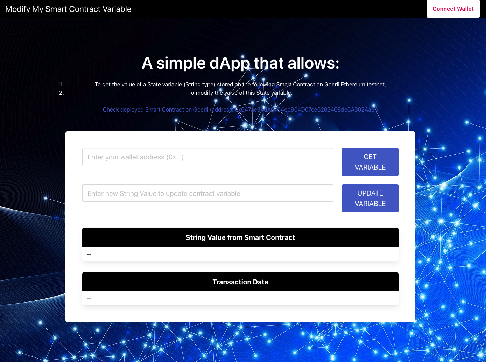

---

# Introduction

This is a simple dApp that includes:

1. a backend part related to the Smart Contract development of the project based on **Solidity + Hardhat**
2. a frontend / UI part based on **React** that allows to interact with the deployed Smart Contract (on Goerli)

Further details are provided in README files inside each part (backend / frontend).

# Launch the frontend part

- `cd frontend`
- `npm start`

Then connect your wallet and start interacting with the App.

# About the backend part of the dApp

A deployed version of the Smart Contract is already deployed on Goerli Ethereum Testnet at the following address:

0x647ae34dA6764eb904D07ce6202468de6A302Aa5

Check on Etherscan (Goerli) for details.
